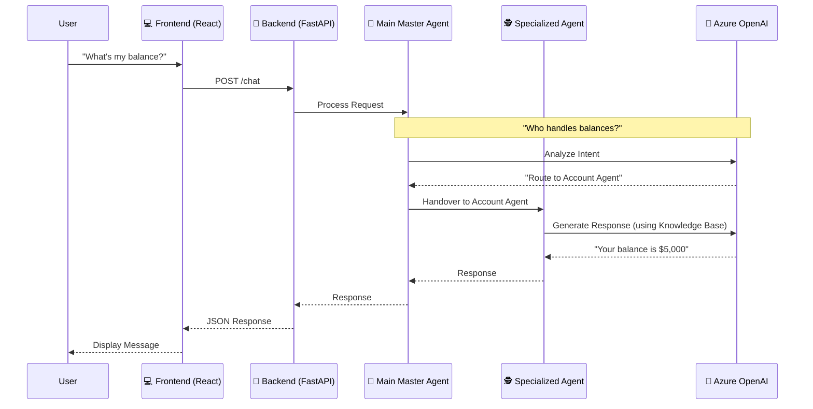

# 🏗️ System Architecture

Welcome to the architectural tour of the **Banking Master Agent**. We've designed this system to be modular, scalable, and intelligent—but let's break it down into plain English.

## 🗺️ The Big Picture

At a high level, the system works like a well-organized office building.
1.  **The Lobby (Frontend)**: Where the user walks in and asks a question.
2.  **The Receptionist (API & Main Agent)**: Takes the question and figures out who should handle it.
3.  **The Departments (Specialized Agents)**: The experts who actually do the work (Loans, Cards, Accounts, etc.).
4.  **The Archives (Knowledge Base & Database)**: Where the experts look up information.

## 🔄 How It Works (The Flow)

Here is the journey of a single user message, from start to finish:

## 🧩 Key Components

### 1. The Frontend (The Face)
*   **Tech**: React, Node.js
*   **Role**: Provides a clean chat interface. It doesn't know anything about banking; it just knows how to send messages to the backend and display the replies nicely.

### 2. The Backend API (The Gateway)
*   **Tech**: Python, FastAPI
*   **Role**: The secure door to the system. It handles:
    *   Receiving requests from the web.
    *   Managing user sessions (so the bot remembers who you are).
    *   Connecting to the agents.

### 3. The Brain (Agno & Azure OpenAI)
This is where the magic happens. We use **Agno** (formerly Phidata) to orchestrate the AI.
*   **Main Master Agent**: The "Router." It doesn't answer banking questions directly. Its only job is to understand *what* you want and find the right expert.
*   **Specialized Agents**: These are the workers. Each one has a specific "System Prompt" that defines its personality and boundaries.
    *   *Account Agent*: Knows about balances and KYC.
    *   *Card Agent*: Knows about credit limits and rewards.
    *   *Transaction Agent*: Knows about spending history.
    *   (And so on...)

### 4. Memory & Storage (The Filing Cabinet)
*   **Tech**: SQLite
*   **Role**:
    *   **Agent Memory**: Remembers the conversation history so you can say "What about *that* transaction?" and it knows what you mean.
    *   **Knowledge Base**: Stored documents (PDFs, text) that agents can "read" to answer specific questions about bank policies.

## 💡 Why This Architecture?

Why not just one big AI?
*   **Accuracy**: A "Jack of all trades" AI often gets confused. By splitting them up, the "Loan Agent" never accidentally answers a question about "Credit Cards" with wrong info.
*   **Security**: We can limit what each agent can see. The "General Service" agent doesn't need access to your transaction history.
*   **Scalability**: Want to add a "Mortgage" department later? Just add a new agent without breaking the others.

